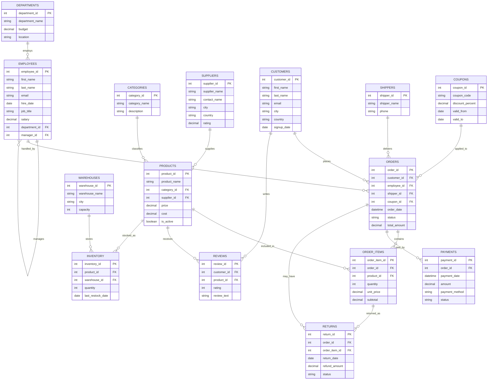

# E-Commerce Database — ER Diagram & Relationship Guide

## Entity-Relationship Diagram (Mermaid)

## Relationship Explanation

**Departments → Employees (1:N)**
Each department has many employees; each employee belongs to exactly one department (`ON DELETE CASCADE`).

**Employees → Employees (self-referencing, 1:N)**
`manager_id` references `employee_id` on the same table, modeling an organizational hierarchy. Top-level managers have `manager_id = NULL`. This is ideal for practicing **self joins** and **recursive CTEs**.

**Employees → Orders (1:N, nullable)**
An employee may process many orders; some orders have no assigned employee (self-checkout / online orders), hence `ON DELETE SET NULL`.

**Categories → Products (1:N)** and **Suppliers → Products (1:N)**
Every product belongs to exactly one category and is sourced from exactly one supplier. Deleting a category or supplier cascades to its products.

**Customers → Orders (1:N)**
A customer can place many orders. Deleting a customer cascades to their orders (simulating full account deletion / GDPR-style erasure).

**Shippers → Orders (1:N, nullable)** and **Coupons → Orders (1:N, nullable)**
An order is shipped by at most one shipper and may optionally use one coupon.

**Orders ↔ Products via Order_Items (M:N)**
`Order_Items` is the classic associative/junction table resolving the many-to-many relationship between orders and products, storing the quantity and price at time of sale.

**Orders → Payments (1:N)**
Each order has at least one payment record (supports retries/partial payments in real systems).

**Orders / Order_Items → Returns (1:N)**
A return always references both the parent order and the specific line item being returned.

**Customers ↔ Products via Reviews (M:N)**
Reviews link a customer's opinion to a specific product; a customer can review many products and a product can have many reviews.

**Warehouses ↔ Products via Inventory (M:N in general, 1:1 in this dataset)**
Inventory tracks stock quantity per product per warehouse. In this generated dataset each product is stocked in exactly one warehouse (enforced by a UNIQUE key on `product_id, warehouse_id`), but the schema supports multi-warehouse stocking.

## Normalization Notes
- All tables are in **3NF**: every non-key attribute depends on the whole primary key and nothing but the key.
- Derived/redundant data is minimized — `Orders.total_amount` is the only intentionally denormalized column (kept for query-performance practice and to mirror real-world order tables), and it is kept in sync via the `sp_place_order_item` stored procedure and can be recomputed via `SUM(Order_Items.subtotal)`.
- Composite uniqueness (`Inventory.product_id + warehouse_id`) prevents duplicate stock rows.
